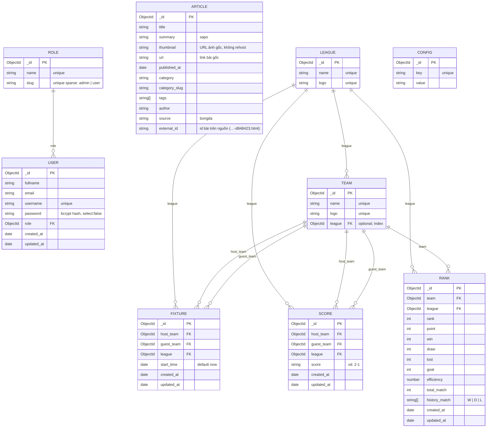

# Sport1 — Mô hình dữ liệu

9 collection trong MongoDB, định nghĩa ở `modules/*/xxxModel.ts`. Sơ đồ dưới dạng
Mermaid — GitHub, VS Code (Markdown Preview Mermaid) và mermaid.live đều render được.



## Nhìn theo nghiệp vụ

```
                 ┌──────────┐
                 │  LEAGUE  │  giải đấu
                 └────┬─────┘
        ┌─────────────┼──────────────┬──────────────┐
        ▼             ▼              ▼              ▼
   ┌─────────┐   ┌─────────┐   ┌─────────┐   ┌─────────┐
   │  TEAM   │   │ FIXTURE │   │  SCORE  │   │  RANK   │
   │ đội bóng│   │lịch đấu │   │ kết quả │   │ bảng xh │
   └────┬────┘   └─────────┘   └─────────┘   └─────────┘
        │          host/guest    host/guest     team
        └────────────┴──────────────┴──────────────┘

   ┌─────────┐      ┌─────────┐      ┌─────────┐
   │  ROLE   │◄─────│  USER   │      │ CONFIG  │  key/value, độc lập
   └─────────┘ role └─────────┘      └─────────┘
```

## Index

| Collection | Index                         | Loại            | Mục đích                        |
| ---------- | ----------------------------- | --------------- | ------------------------------- |
| users      | `username`                    | unique          | đăng nhập                       |
| roles      | `name`                        | unique          |                                 |
| roles      | `slug`                        | unique, sparse  | tìm role `admin` / `user`       |
| leagues    | `name`, `logo`                | unique          |                                 |
| teams      | `name`, `logo`                | unique          |                                 |
| teams      | `league`                      |                 | đội của một giải                |
| fixtures   | `league, start_time`          | compound        | `GET /fixtures/league/:id` sort |
| scores     | `league`                      |                 | `GET /scores/league/:id`        |
| ranks      | `league, rank`                | compound        | bảng xếp hạng theo thứ tự       |
| ranks      | `league, team`                | **unique**      | 1 đội chỉ có 1 dòng / giải      |
| configs    | `key`                         | unique          |                                 |
| articles   | `source, external_id`         | unique, partial | upsert idempotent từ crawler    |
| articles   | `published_at`                | desc            | tin mới nhất                    |
| articles   | `category_slug, published_at` | compound        | tin theo chuyên mục             |

## Ràng buộc & quy ước

- **Bắt buộc** (`required`): `Fixture.{host_team, guest_team, league}`,
  `Score.{host_team, guest_team, league}`, `Rank.{team, league}`, `User.{fullname, email,
username, password}`. `Team.league` là **tuỳ chọn**.
- Populate mặc định khi đọc: `Team.league`, `Fixture.*`, `Score.*`, `Rank.{team, league}`,
  `User.role`.
- `User.password` có `select: false` — không bao giờ ra khỏi API; chỉ `authLogin` đọc bằng
  `.select("+password")`.
- Timestamps `created_at` / `updated_at` tự động ở User, Fixture, Score, Rank. League, Team,
  Role, Config **chưa có** timestamps.
- `Score.score` là chuỗi `"H-A"` (validate bằng regex); client tự parse.
- `Rank.history_match` là mảng `W`/`D`/`L`, tối đa 20 phần tử, mới nhất ở cuối (quy ước,
  backend không tự ghi).

## Điểm đáng lưu ý khi phát triển tiếp

1. **Không có cascade delete.** Xoá League/Team không xoá Fixture/Score/Rank tham chiếu;
   `populate` sẽ trả `null` cho ref đã mất. Cần middleware `pre("deleteOne")` hoặc soft delete.
2. **Fixture và Score không liên kết nhau.** Một trận đấu có 2 bản ghi độc lập (lịch và kết
   quả) chỉ trùng nhau qua `host_team + guest_team + league`. Hướng gọn hơn: gộp `score`
   (nullable) và `status` vào Fixture, bỏ collection Score.
3. **Rank là dữ liệu nhập tay**, không được tính từ Score. Nếu muốn tự động, cần job/hook
   tính lại `win/draw/lost/point/rank` mỗi khi Score thay đổi.
4. **Team chỉ thuộc 1 League** (`Team.league` đơn). Đội đá nhiều giải (cúp + VĐQG) phải tạo
   nhiều bản ghi Team → vướng unique `name`. Nếu cần, chuyển sang bảng nối `TeamLeague` hoặc
   bỏ `Team.league` và dựa vào Rank/Fixture để suy ra.
5. `League.logo` và `Team.logo` **unique** — hai đội dùng cùng logo placeholder sẽ bị 409.
